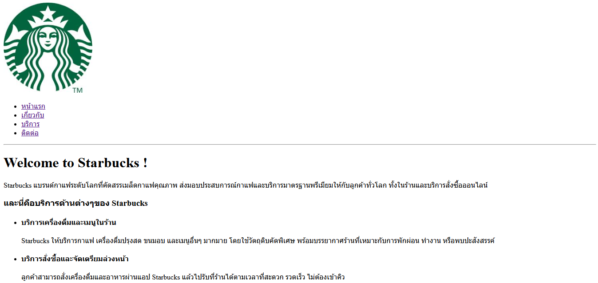
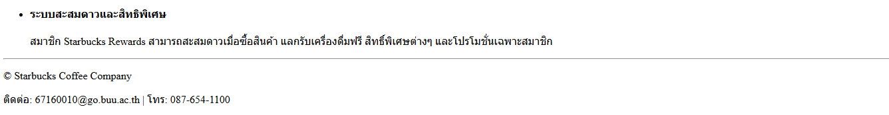
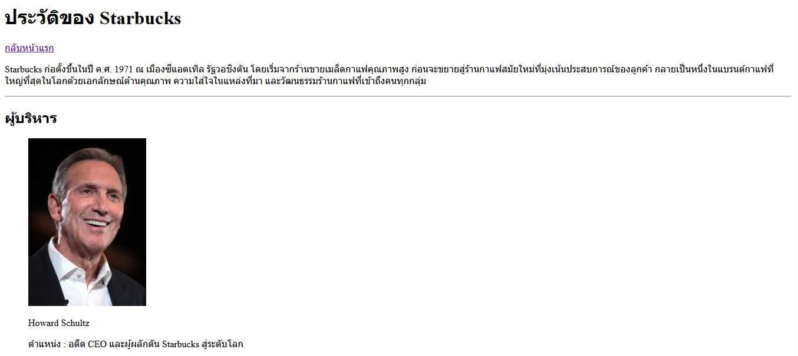
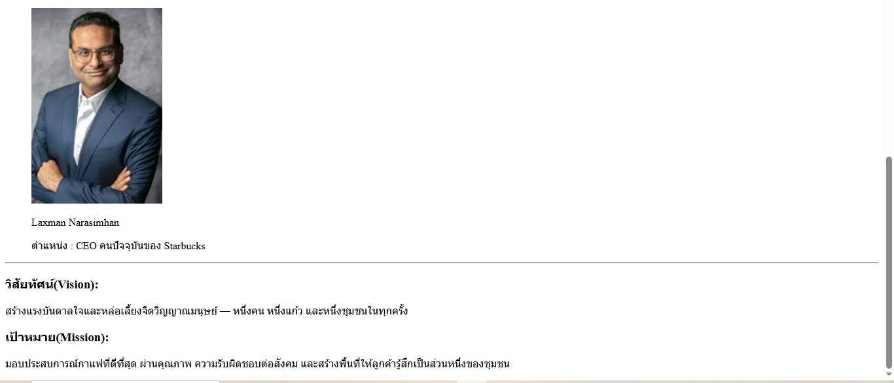
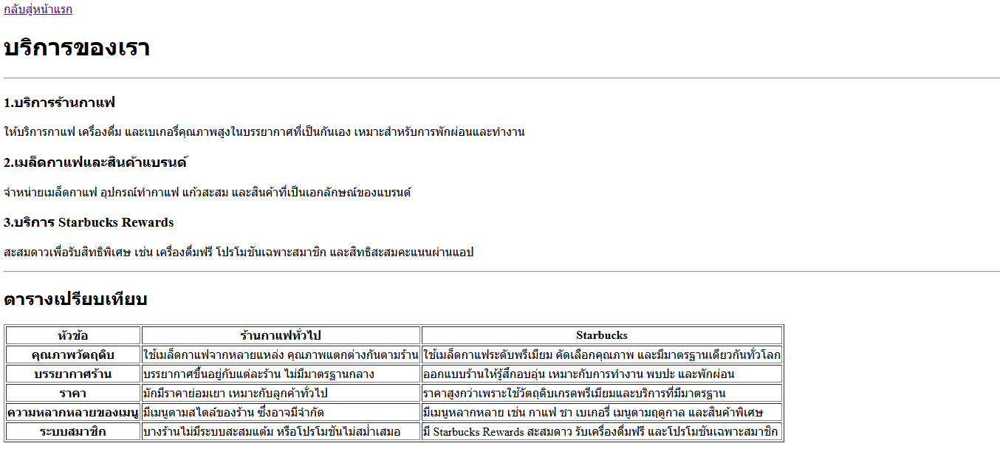
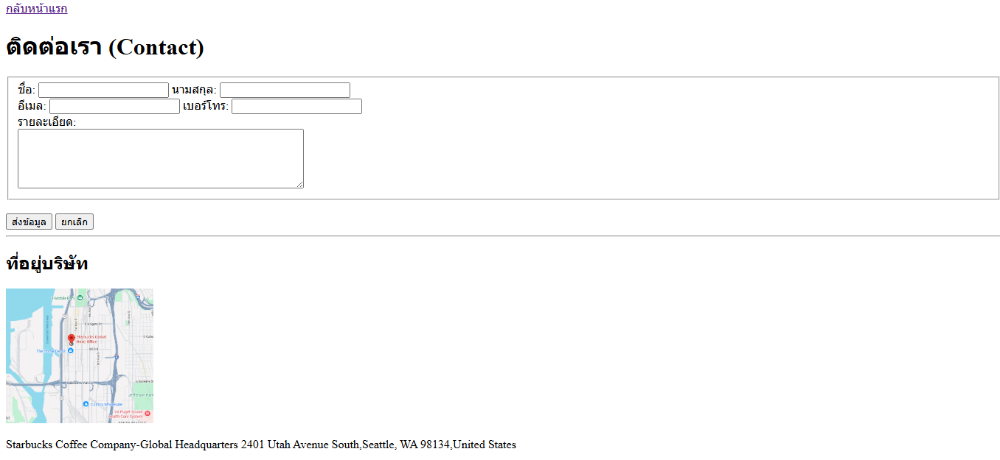

# Starbucks Website

เป็นโปรเจกต์ที่แนะนำเว็บไซต์ของร้านกาแฟ Starbucks โดยจัดทำขึ้นเพื่อแสดงข้อมูลเกี่ยวกับเมนู เครื่องดื่ม โปรโมชั่น และบรรยากาศของร้านพร้อมทั้งออกแบบหน้าเว็บให้ใช้งานง่ายและสะท้อนเอกลักษณ์ของแบรนด์ Starbucks

# จุดประสงค์ของ Starbucks
เพื่อให้ผู้ใช้งานสามารถเข้าถึงข้อมูลเมนู โปรโมชั่น และรายละเอียดของร้าน Starbucks ได้สะดวกยิ่งขึ้น พร้อมมอบประสบการณ์การใช้งานที่ทันสมัยและเหมาะกับทุกอุปกรณ์

# โครงสร้างของ website
my-business-web/
├── index.html
├── about.html
├── services.html
├── contact.html
├── README.md
└── images/
└──...

# ลิงก์เข้าสู่หน้าต่างๆ
[หน้าแรก](index.html)

[เกี่ยวกับเรา](about.html)

[บริการของเรา](services.html)

[ติดต่อเรา](contact.html)
